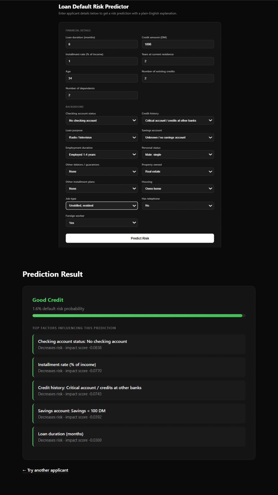
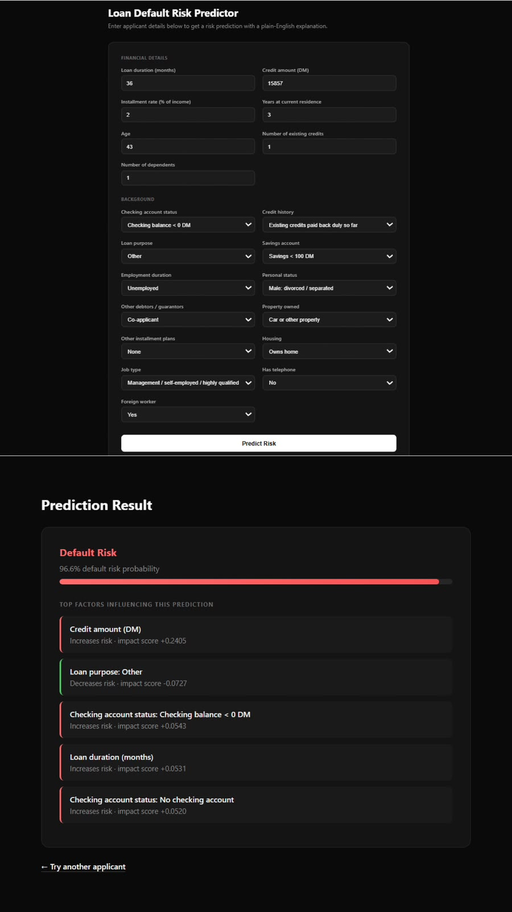

# Loan Default Risk Predictor

A machine learning pipeline that predicts loan default risk and explains
*why* each prediction was made — built to be genuinely defensible in an
interview, not just a black-box model wrapped in an API call.

## The Problem

Lenders need to predict whether an applicant is likely to default — but a
model that just outputs "risky" or "safe" isn't good enough in a regulated
industry like lending, where decisions need to be explainable. This project
builds that full pipeline: data → imbalance-aware modeling → model
comparison → explainability → a usable interface.

## Key Finding

The dataset has a real class imbalance (**70% good credit / 30% default
risk**). After training both a Logistic Regression baseline and an XGBoost
model with proper imbalance handling (`class_weight="balanced"` /
`scale_pos_weight`), **Logistic Regression achieved better recall on the
default class (0.80 vs 0.57)** despite being the simpler model.

This matters because in lending, missing an actual default (a false
negative) is typically costlier than a false alarm — so for this dataset
and use case, the simpler, more interpretable model is arguably the better
choice, not just the "safer fallback." Model complexity isn't automatically
better, especially on a small dataset (1,000 rows).

| Model | Recall (Default Risk) | Precision (Default Risk) | ROC-AUC |
|---|---|---|---|
| Logistic Regression | **0.80** | 0.56 | **0.806** |
| XGBoost | 0.57 | 0.61 | 0.783 |

## Architecture

```
src/
├── load_data.py    # Load + clean the raw dataset, check class balance
├── train_model.py  # Train Logistic Regression + XGBoost, evaluate properly
├── explain.py       # SHAP explainability — per-applicant + global feature importance
├── app.py            # Flask web interface tying it all together
data/
└── german_credit.csv  # UCI Statlog German Credit dataset
```

**Design decisions worth noting:**
- **Imbalance handling** is built into training (`class_weight="balanced"`
  for Logistic Regression, `scale_pos_weight` for XGBoost), not patched on
  afterward.
- **Evaluation uses precision/recall/F1/ROC-AUC**, not accuracy — on a 70/30
  imbalanced dataset, accuracy alone would be misleading (a model that
  always predicts "safe" would score 70% accuracy while catching zero
  actual defaults).
- **SHAP explainability runs on the *transformed* feature space** (after
  one-hot encoding), not raw text columns, since SHAP requires numeric
  input. Feature names are translated back to human-readable form for
  display.

## Screenshots

**Safe applicant (1.6% predicted default risk):**


**Risky applicant (96.6% predicted default risk), with SHAP explanation:**


## Tech Stack

- **Data & modeling:** pandas, scikit-learn, XGBoost
- **Explainability:** SHAP
- **Interface:** Flask
- **Dataset:** [UCI Statlog German Credit Data](https://archive.ics.uci.edu/dataset/144/statlog+german+credit+data)

Everything here runs free and local — no paid APIs required.

## Running Locally

```bash
# Clone the repo
git clone https://github.com/YOUR_USERNAME/loan-risk-predictor.git
cd loan-risk-predictor

# Set up a virtual environment
python -m venv venv
venv\Scripts\activate        # Windows
# source venv/bin/activate   # Mac/Linux

# Install dependencies
pip install pandas scikit-learn xgboost joblib shap matplotlib flask

# Download the dataset from UCI and place it at data/german_credit.csv
# https://archive.ics.uci.edu/dataset/144/statlog+german+credit+data

# Run each step
python src/load_data.py     # Explore the data
python src/train_model.py   # Train + evaluate both models
python src/explain.py        # Generate SHAP explanations + summary chart

# Launch the web app
python src/app.py
# Open http://127.0.0.1:5000
```

## Known Limitations

- Only handles the 20 features present in the UCI German Credit dataset —
  not tested on other loan datasets with different schemas
- Dataset is relatively small (1,000 rows), which is part of why the
  simpler model outperforms XGBoost here — this finding may not generalize
  to larger datasets
- No persistent storage — predictions aren't saved/logged anywhere
- Single-model deployment (Logistic Regression only) in the web app, since
  it had the better recall; XGBoost results are documented above but not
  wired into the live interface

## What I'd Add With More Time

- A/B comparison of both models directly in the app interface
- Persistent history of past predictions (SQLite)
- Batch prediction (upload a CSV of applicants, get results for all)
- Cross-validation instead of a single train/test split, to check how
  stable the Logistic Regression vs. XGBoost recall gap is
